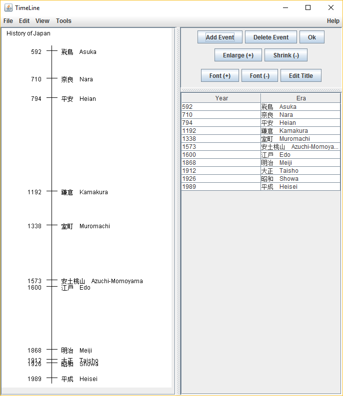

TimeLine
========

This goes the opposite of the 'mental map' of things.

TimeLine shows the proportional representation of the lapse of time in the sequence of events.

Edit the table on the right and the time line will show up on the left.

